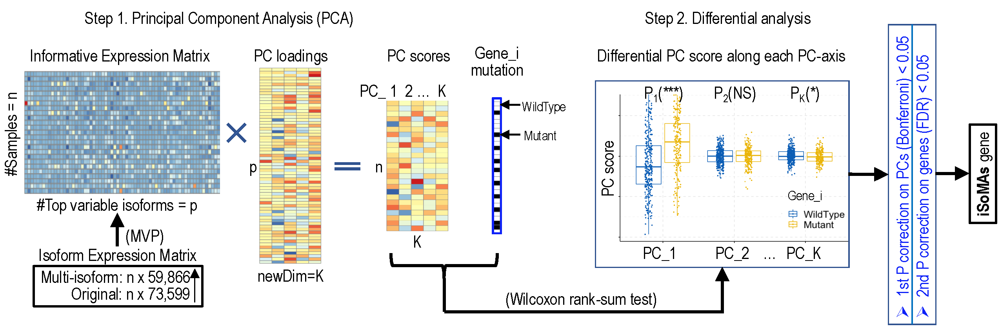

```{r, include = FALSE}
knitr::opts_chunk$set(
  collapse = TRUE,
  comment = "#>"
)
```


# Introduction
This iSoMAs package contains the proposed “iSoMAs” (iSoform expression and somatic Mutation Association) algorithm (function `iSoMAs`), an efficient computational pipeline based on principal component analysis (PCA) techniques for exploring the association between somatic single nucleotide variant (SNV) and gene isoform expression through both cis- and trans-regulatory mechanisms. We have shown that iSoMAs is more efficient and versatile than existing methods in identification of SNV-isoform expression associations. Since iSoMAs implements differential analysis along a small number of PC coordinates (always ≤50) rather than along thousands of original transcript axes directly, it dramatically outperforms the existing models in efficiency. Furthermore, iSoMAs searches for the SNV-associated isoform expression over the whole transcriptome simultaneously, indicating its versatility compared to previous studies. Most importantly, iSoMAs overcomes the limitation of the low mutation frequencies of most cancer genes by examining the association between an SNV and the meta-isoform expression quantified as the PC score, well reducing the false positive rate incurred by the traditional gene-by-gene association study.

iSoMAs integrates sample-matched RNA-seq and DNA-seq data to study the association between gene somatic mutations and gene isoform expression. The iSoMAs workflow consists of two steps: In the first step, the high-dimensional gene isoform expression matrix (`d=59,866` derived from the `15,448` multi-isoform genes) for each cancer type is trimmed by mean.var.plot method (built in the Seurat toolkit) into a more informative expression matrix, which keeps only the most variable isoforms but is still high-dimensional (`d~3,500`). After that, the Principal Component Analysis (PCA) is performed to further reduce the dimension of the informative expression matrix into a much lower-dimensional PC score matrix (`d<=50`) by calculating a PC loading matrix. Each column of the PC loading matrix performs a particular linear combination of the top variable isoforms into a meta-isoform, with the combination coefficients stored in the corresponding column of the PC loading matrix. All the meta-isoforms comprise the coordinates of the new low-dimensional space. In the second step, a differential PC score analysis is conducted along each of the 50 PC-coordinates based on the mutation status of the studied gene by Wilcoxon rank-sum test. Following the differential PC score analysis, the significant genes (termed iSoMAs genes) are determined if the minimum of the 50 p-values [defined as `minP = min{P1,P2,...,P50}`] is smaller than a predefined threshold (i.e.,`minP<1e-3`).

```{r pressure, echo=FALSE, fig.cap="", fig.align="center", out.width = '95%'}

```

In this tutorial, we guide users to execute iSoMAs and visualize/interpret the iSoMAs results step-by-step. This tutorial was implemented on R version 4.3.1 (2023-06-16) on macOS Monterey 12.6.5. The latest developmental version of iSoMAs can be downloaded from GitHub and installed from source by `devtools::install_github('elnitskilab/iSoMAs')`. After installation, we load the package as below:


```{r setup}
library(iSoMAs)
```

# Run iSoMAs
Four datasets are required as iSoMAs inputs: a isoform expression matrix (`data.iso`), a gene somatic mutation table as a maf (mutation annotation format) (`data.maf`), two mapping files between gene names and their associated isoforms (`gene_to_iso`, `iso_to_gene`). iSoMAs automatically determines a qualified list of genes to test (`genes_to_test`) if not designated [In this demo, we test only the first 100 genes in the list of genes_to_test, and therefore you may see a little difference than the manuscript]. An example of the four datasets collected from TCGA-LUAD project have been incorporated into this package and can be used directly. Users can also download them from the following sites and load to the work space manually.

data.iso [data.frame: 73,599 * 576]: 
https://drive.google.com/file/d/1pE4L7mkuUy_Ry6-9xMP7acx4ElSLibcD/view?usp=share_link


data.maf [data.frame: 208,180 * 120]: 
https://drive.google.com/file/d/14inFBJhHItABaA0-1gs5z11gO7NeflY_/view?usp=share_link


gene_to_iso [list of list: 29,181 elements], iso_to_gene [list: 73,599 elements]:
https://drive.google.com/file/d/1_Ua0tCoLbtgIgn3Lfemz3OfEzz2hl4Z9/view?usp=share_link'


```{r warning=FALSE}
res_isomas = iSoMAs(data.iso,data.maf,gene_to_iso,iso_to_gene,
                  genes_test=NULL,
                  stat.method="wilcox",
                  ntop.gene=100, minP.sorted = T,
                  filename = "res_iSoMAs_TCGA-LUAD.RData")
```


The output of iSoMAs `res_isomas` is a 21-entry list containing the input arguments, the PCA and differential PC score analysis results:

```{r}
str(res_isomas,max.level = 1)
```

The first entry `pca` of the iSoMAs output is a SeuratObject generated by the `Seurat` package, in which `cell.embeddings` refers to the PC score matrix with samples in rows and PC coordinates in columns, and `feature.loadings` refers to the PC loading matrix with features (isoforms) in rows and PC coordinates in columns. PC coordinates are denoted as {PC_1, PC_2, ..., PC_50}.
```{r}
str(res_isomas$pca,max.level = 2)
print(res_isomas$pca@cell.embeddings[1:5,1:3])
print(res_isomas$pca@feature.loadings[1:5,1:3])
```

The `pvals_all_sorted` lists the tested genes ranked by `minP`.
```{r warning=TRUE}
nc = ncol(res_isomas$pvals_all_sorted)
print(head(res_isomas$pvals_all_sorted[,c(1:4,(nc-1):nc)]))
```


# Visualize and interpret iSoMAs output
In the following sections, we use simple examples to show how to interpret the iSoMAs output. Since TP53 was detected as a iSoMAs gene in most cancer types (18 out of 33). We will always use TP53 as an example if applicable. First, we extract the p-value table and determine the PC-coordinates along which  TP53 was tested significant in the differential PC score analysis for subsequent use:

```{r warning=T}
myGene.mut = "TP53"
project = res_isomas$project
pvals_all = res_isomas$pvals_all

pvals_sig = get_pvals_sig(pvals_all,myGene = myGene.mut)
PCs_sig = colnames(pvals_sig)
```

## Plot the top iSoMAs genes detected in a specific cancer type

For each gene tested, the `minP` along all 50 PC coordinates is first obtained.Then, all tested genes are ranked based on their `minP`. Only genes with `minP<pval.thres` were considered in this analysis. Users can control the number of top iSoMAs genes (`idx.plot`) to show.

```{r fig.align="center", fig.width = 10}
mat.plot = plot_isomas_pvals(pvals_all,sorted = T,pval.thres = 1e-3,
                            showNsamp = T,idx.plot = 10,
                            p.log10 = T,
                            show_rwnms = T,lgd = T,plot.sig = T,
                            get.data = T,scale.by = "none",fs = 16,
                            title = project)
```


## Plot differential PC score along significant PC-axes

Differential PC score analysis along significant PC-coordinates upon gene somatic mutation. Users can control the statistic method (Wilcoxon or t-test) and the type of p-value to show (significance level or p-value itself) and other visualization options:

```{r fig.align="center", fig.width = 5}
plot_PCscore_along_PCs(res_isomas,data.maf,myGene.mut,PCs=PCs_sig,label.comp="p.signif",
                       title.legend=myGene.mut,title.plot=project,fs=16,sz=10,
                       legend.position = c(0.75,0.15),
                       xlab = NULL,method = "wilcox",
                       legend.direction = "vertical")
```

## Plot PC loadings along designated PC-axes

We can also show the weights (in PCA: PC loading) of features (in this study: isoforms) along each designated PC-axis. In this specific example, features (isoforms) are ranked by the feature loadings (see res_isomas$pca@feature.loadings) along PC_2.

```{r fig.align="center", fig.width = 7.5}
plot_feature_loadings_along_PCs(res_isomas,PCs=PCs_sig,PC.ord = 'PC_2',fs=16)
```


## Plot expression of top target isoforms along designated PC-axes

Heatmap shows scaled expression levels of the top positive and negative isoforms of all samples ordered by their PC scores along PC_2 axis in LUAD cancer. The isoforms were ranked by the PC loading value along PC_2 axis. In this example, we include the TP53 mutation status of samples in the column annotation bar. Users can add new columns to `iso@meta.data` to account for other sample information (e.g., survival, drug response, tumor stage, tumor purity, etc.). This figure clearly shows the enrichment of samples with TP53 mutation in samples with high level of PC score, high level of some genes (e.g., TPX2) and low level of some other genes (e.g., SELENBP2).

```{r fig.align="center", fig.width = 10}
iso = run_PCA_Seurat(data.iso=trim_features_and_samples_TCGA(data.iso,gene_to_iso,iso_to_gene),
                     res_isomas=res_isomas)
Mutations = get_maf_of_interest_TCGA(data.maf,
                                     myGene=myGene.mut,
                                     mySamples=rownames(iso@meta.data))
iso@meta.data$Mutation = Mutations$Mutation
data.heat = plot_isomas_heatmap(iso,dims = PCs_sig[1], nfeat.pos = 6, nfeat.neg = 6,
                               anno_row = F, anno_col = T, anno_col_keys = c("Mutation"),
                               anno_legend = T, get.data = F,fs = 16,
                               show_rwnms = T,
                               iso_to_gene = iso_to_gene, show_gname = T,
                               title=paste0(project,", ", myGene.mut))
```


## Plot correlation between PC score and isoform expression

The function `plot_correlation_PCscore_isoExpr2` generates a volcano-style figure showing the Spearman correlation between the PC score along a particular PC-axis and the expression level of the top isoforms associated with a iSoMAs gene. The x and y axes represent the Spearman correlation coefficient ($\rho$) and the `-log10(p-value)` respectively. The significant correlation between PC score and isoform expression level is critical for ensuring that those top isoforms are also significantly associated with the iSoMAs gene mutation status as the PC score does (with high probability).

```{r warning=FALSE,fig.align="center", fig.width = 5}
plot_correlation_PCscore_isoExpr2(res_isomas,iso,nfeat.pos = NULL, nfeat.neg = NULL, nfeat.pos.mark=50, nfeat.neg.mark=50, PCs=PCs_sig[1])
```


## Plot differential isoform expression upon gene mutation

iSoMAs identified the somatic mutations associated gene expression alternations in an indirect way. Specifically, considering the linear combination property in PCA, we assume that the top isoforms (those with largest absolute PC loading values) contribute most to the significant association between the mutations status of a gene and the level of PC score. In this sense, the top isoforms are more likely to be significantly associated with the mutation status of this gene compared to the bottom ones. The function `plot_iso_expr_upon_gene_mutation` checks the differential expression (at the isoform-level) upon gene mutation directly, which is a straightfoward verification of the iSoMAs results.

```{r fig.align="center", fig.width = 7.5}
data.iso.mut = plot_iso_expr_upon_gene_mutation(
  data.iso,Mutations,gene_to_iso, myGene.mut=myGene.mut,
  myGene.iso='TPX2', isoIDs = NULL, rmNorm = T,
  plot.percent = F,Log2 = T,normData = F,
  label = "p.signif", stat.method = "wilcox",
  legend.position = 'right',plot.gene = F,
  angle.p = 0,label.y.npc = 1,
  legend.direction = "vertical",fs = 16,sz=10,
  get.data=T, title=project)
```


## Calculate and visualize the PC score approximation process
In this section, we regenerate the PC score with the top transcripts (gene expression at isoform-level). Users can designate the number of top isoforms used to approximate the PC score along a specific PC-axis. We will see that using all features (in this example, `3315` variable isoforms) completely regenerates the PC score.

```{r fig.align="center", fig.width=10}
res_PCapprox = do_PCscore_approximation(res_isomas,iso,add.method = 'accumulatively',
                                        sign.PC='both',verbose = 0)
plist = plot_PCscore_approximation(res_PCapprox)
ggpubr::ggarrange(plotlist = plist[1:6],ncol = 3,nrow = 2)
```


# Reference

iSoMAs: Finding isoform expression and somatic mutation associations in human cancers

Hua Tan, Valer Gotea, David O. Holland, Kevin Fedkenheuer, Sushil K. Jaiswal, Nancy Seidel, Sara Bang-Christensen, Laura Elnitski*


